# Running an Engagement

This page describes how the **CTF orchestrator** drives a penetration test from target to objective. The orchestrator is one skill (`skills/orchestrator/SKILL.md`) — a different orchestrator would change this entire workflow.

!!! note "Orchestrator-driven workflow"
    Everything described here is the behavior of the built-in CTF orchestrator. The skill library itself is orchestrator-agnostic — you could write a different orchestrator that uses the same skills in a completely different workflow.

## Starting a Test

Trigger the orchestrator with a target:

```
attack 10.10.10.5
pentest 192.168.1.0/24
hack school.flight.htb
```

Any of these trigger phrases work: `attack`, `pentest`, `hack`, `scan`, `assess`, `test`, `pop`, `engage`, or `CTF target`.

### Scope Gathering

The orchestrator's first action is gathering scope:

1. **Targets** — IPs, hostnames, CIDR ranges
2. **Credentials** — any provided usernames, passwords, hashes
3. **Rules of engagement** — what's in scope, what's off-limits
4. **Objectives** — flags, domain admin, data exfiltration goals

### Engagement Directory

The orchestrator creates the engagement directory structure:

```
engagement/
├── scope.md          # Target scope and rules of engagement
├── state.db          # SQLite engagement state database
├── activity.md       # Chronological action log
├── findings.md       # Confirmed vulnerabilities
└── evidence/         # Saved output and dumps
    └── logs/         # Agent JSONL transcripts
```

It initializes `state.db` via `init_engagement()` and writes the scope to `scope.md`.

## Engagement Workflow

The orchestrator follows this decision flow from target to objective:

```mermaid
flowchart TD
    Start(["User: &quot;attack TARGET&quot;"]) --> Scope

    subgraph S1["Scope & Setup"]
        Scope[Gather scope, creds,<br>rules of engagement]
        Scope --> Init[mkdir engagement/<br>init_engagement]
        Init --> WriteScope[Write scope.md<br>activity.md · findings.md]
    end

    WriteScope --> ScanQ

    subgraph S2["Reconnaissance"]
        ScanQ{HARD STOP<br>Scan type?}
        ScanQ -->|quick / full / custom| NR[network-recon-agent<br>→ network-recon]
        ScanQ -->|import XML| Parse[Parse XML<br>record to state]

        NR --> RecordRecon[Record hosts, ports,<br>services to state]
        Parse --> RecordRecon

        RecordRecon --> HostCheck{New hostnames<br>resolve?}
        HostCheck -->|no| HostsFix["HARD STOP<br>Write hosts-update.sh<br>Wait for operator"]
        HostsFix -->|operator confirms| HostCheck
        HostCheck -->|yes| WebPorts{HTTP/HTTPS<br>ports found?}

        WebPorts -->|yes| WD[web-discovery-agent<br>→ web-discovery]
        WebPorts -->|no| Surface

        WD --> VhostCheck{Vhosts<br>resolve?}
        VhostCheck -->|no| HostsFix
        VhostCheck -->|yes| Surface
    end

    Surface[Categorize attack surface<br>Web · AD · SMB · DB<br>Containers · Remote Access]

    Surface -->|"Present surface +<br>chain analysis<br>Operator picks path"| SkillPick

    subgraph S4["Discovery & Exploitation"]
        SkillPick[Pick skill + agent<br>from routing table]
        SkillPick --> Spawn[Spawn agent<br>with skill + context]
        Spawn --> AgentRun

        subgraph AgentBox["Agent invocation"]
            AgentRun[Load skill → execute<br>→ save evidence<br>→ return findings]
        end
    end

    AgentRun --> PostSkill

    subgraph Post["Post-Skill Checkpoint"]
        PostSkill[Parse return summary]
        PostSkill --> RecordState["Record to state:<br>add_target · add_credential<br>add_vuln · add_access<br>add_pivot · add_blocked"]
        RecordState --> LogActivity[Append activity.md<br>+ findings.md]
        LogActivity --> UserCheck{New usernames<br>discovered?}
        UserCheck -->|yes| SprayStop
        UserCheck -->|no| ChainAnalysis
    end

    subgraph Spray["Credential Attack Gate"]
        SprayStop["HARD STOP<br>Show usernames<br>+ lockout policy"]
        SprayStop --> SprayQ{Spray<br>intensity?}
        SprayQ -->|skip| ChainAnalysis
        SprayQ -->|light / medium / heavy| PW[password-spray-agent<br>→ password-spraying]
        PW --> RecordCreds[Record valid creds<br>to state]
        RecordCreds --> ChainAnalysis
    end

    subgraph S5["Chaining"]
        ChainAnalysis["get_state_summary()<br>Analyze pivot map"]
        ChainAnalysis --> D1{Unexploited<br>vulns?}
        D1 -->|yes| SkillPick
        D1 -->|no| D2{Shell access<br>without root?}
        D2 -->|yes| DiscoverHost
        D2 -->|no| D3{Untested<br>creds?}
        D3 -->|yes| TestCreds[Test creds against<br>all services]
        TestCreds --> SkillPick
        D3 -->|no| D4{Uncracked<br>hashes?}
        D4 -->|yes| Crack["credential-cracking<br>(inline)"]
        Crack --> ChainAnalysis
        D4 -->|no| D5{Pivot paths<br>available?}
        D5 -->|yes| SkillPick
        D5 -->|no| D6{Objectives<br>met?}
    end

    subgraph HostDisc["Shell → Host Discovery"]
        DiscoverHost{OS?}
        DiscoverHost -->|Linux| LinDisc[linux-privesc-agent<br>→ linux-discovery]
        DiscoverHost -->|Windows DC| ADEnum[ad-discovery-agent<br>→ ad-discovery]
        DiscoverHost -->|Windows non-DC| WinDisc[windows-privesc-agent<br>→ windows-discovery]
        LinDisc & ADEnum & WinDisc --> PostSkill
    end

    AgentRun -->|"AV blocked"| AVRecover
    AgentRun -->|"clock skew"| ClockRecover

    subgraph Recovery["Recovery Paths"]
        AVRecover[evasion-agent<br>→ av-edr-evasion]
        AVRecover -->|"bypass payload"| Spawn
        AVRecover -->|"no bypass"| RecordBlocked[add_blocked<br>move to next vector]
        RecordBlocked --> ChainAnalysis

        ClockRecover["Write clock-sync.sh<br>Wait for operator"]
        ClockRecover -->|"synced"| Spawn
    end

    D6 -->|yes| PostExploit
    D6 -->|no| Stuck[No more paths<br>Report current state]

    subgraph S6["Post-Exploitation"]
        PostExploit[Collect evidence<br>Update state<br>Verify objectives]
    end

    PostExploit --> Done
    Stuck --> Done

    Done([Engagement Complete])
    Done -.-> Retro[retrospective<br>→ skill improvements]
```



## Reconnaissance

After scope setup, the orchestrator runs reconnaissance.

### Scan Type Selection

!!! warning "Hard Stop"
    The orchestrator pauses and asks the operator to choose a scan type before proceeding. This is the first of several **hard stops** — points where the orchestrator requires operator input.

Options:

- **Quick** — Top ports, fast service detection
- **Full** — All 65535 ports with version detection and scripts (`-A -p- -T4`)
- **Custom** — Operator-specified nmap flags
- **Import XML** — Parse existing nmap XML output

The orchestrator spawns the `network-recon-agent` with the `network-recon` skill, which runs nmap via the nmap-server MCP and enumerates discovered services.

### Hostname Resolution

When nmap discovers hostnames that don't resolve from the attackbox, the orchestrator hits a **hard stop**:

1. Writes a `hosts-update.sh` script with the required `/etc/hosts` entries
2. Pauses and asks the operator to run it
3. Resumes only after confirmation

This pattern repeats when web discovery finds virtual hosts that need resolution.

### Web Discovery

If HTTP/HTTPS ports are found, the orchestrator spawns the `web-discovery-agent` with the `web-discovery` skill. This performs content discovery, technology fingerprinting, parameter fuzzing, and vulnerability identification.

## Attack Surface Presentation

After recon, the orchestrator categorizes the attack surface:

- **Web** — HTTP/HTTPS services, applications, APIs
- **Active Directory** — Domain controllers, Kerberos, LDAP
- **SMB** — File shares, named pipes
- **Database** — MSSQL, MySQL, PostgreSQL
- **Containers** — Docker, Kubernetes
- **Remote Access** — SSH, RDP, WinRM

It presents the surface with chain analysis — how vulnerabilities might connect to achieve objectives — and the operator picks the attack path.

## Skill Routing

The orchestrator picks the right agent and skill from the [routing table](agents.md#routing-table). Context from the current engagement state is passed in the task prompt:

- Injection point details (URL, parameter, method)
- Target technology (framework, database, OS version)
- Working payloads from previous skills
- Credentials and access levels

See [Agents](agents.md) for the full agent model and routing details.

## Hard Stops

The orchestrator has several points where it **must** pause for operator input:

| Hard Stop | When | Why |
|-----------|------|-----|
| **Scan type** | Before reconnaissance | Operator controls scan intensity and stealth |
| **Hostname resolution** | New hostnames discovered | `/etc/hosts` changes require sudo |
| **Password spray intensity** | New usernames discovered | Spray intensity affects account lockout risk |
| **Vhost resolution** | Web discovery finds virtual hosts | Same as hostname resolution |

Hard stops prevent the orchestrator from making high-impact decisions autonomously. The operator always controls scan intensity, credential spraying risk, and system-level changes.

## Chaining Logic

After each skill completes, the orchestrator runs a **chaining analysis** using `get_state_summary()`. It walks this decision tree:

1. **Unexploited vulnerabilities?** → Route to the matching technique skill
2. **Shell access without root/admin?** → Route to host discovery (Linux or Windows)
3. **Untested credentials?** → Test against all known services
4. **Uncracked hashes?** → Route to credential-cracking (inline)
5. **Pivot paths available?** → Route to the skill that exploits the pivot
6. **Objectives met?** → Post-exploitation and wrap-up

This loop continues until objectives are met or all paths are exhausted. The pivot map in state tracks "what leads where" — a SQL injection that yields database credentials, credentials that work on a different host, a privilege escalation that enables DCSync.

## Recovery Paths

When agents hit obstacles, the orchestrator has structured recovery:

### AV/EDR Blocked

When a payload is caught by antivirus:

1. The technique agent stops and returns structured AV-blocked context
2. The orchestrator spawns the `evasion-agent` with `av-edr-evasion`
3. The evasion agent builds a bypass payload (custom compilation, AMSI bypass, LOLBins)
4. The orchestrator re-invokes the original skill with the AV-safe payload
5. If no bypass works, the technique is recorded as blocked and the orchestrator moves to the next vector

### Clock Skew

Kerberos authentication fails when clock skew exceeds 5 minutes:

1. The orchestrator writes a `clock-sync.sh` script
2. Pauses for the operator to sync clocks
3. Re-invokes the skill after confirmation

### DNS Resolution Failure

When tools fail on hostname resolution, the orchestrator follows the same hostname resolution hard stop pattern.

## Monitoring During Engagement

### Dashboard

The [agent dashboard](dashboard-and-monitoring.md) provides real-time visibility into what agents are doing. Run it in a separate terminal:

```bash
bash tools/agent-dashboard/dashboard.sh
```

### Event Watcher

The orchestrator spawns an event watcher (`tools/hooks/event-watcher.sh`) in the background to poll `state_events` for real-time findings from discovery agents. When a discovery agent writes a credential or vulnerability mid-run, the event watcher detects it and notifies the orchestrator.

See [Dashboard and Monitoring](dashboard-and-monitoring.md) for full details.

## Post-Engagement

When objectives are met (or all paths exhausted), the orchestrator:

1. **Collects evidence** — ensures all findings are in `engagement/evidence/`
2. **Updates state** — marks vulnerabilities as `done`, verifies access records
3. **Verifies objectives** — confirms flags captured, access achieved
4. **Summarizes** — produces an engagement summary with key findings

### Retrospective

The `retrospective` skill performs post-engagement analysis:

- Parses agent JSONL transcripts from `engagement/evidence/logs/`
- Identifies skill routing gaps (where the orchestrator made suboptimal choices)
- Suggests actionable improvements to skills and routing
- Helps improve the skill library based on real engagement experience
